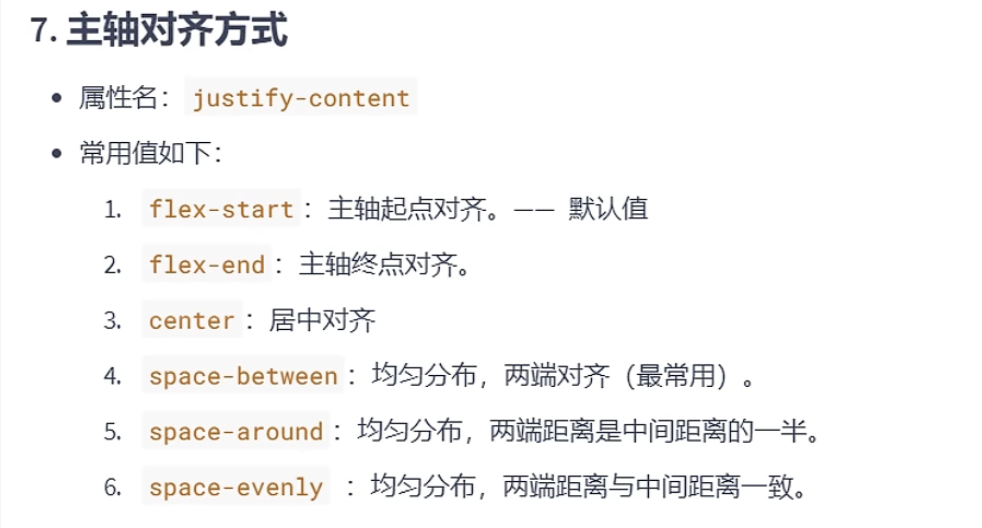
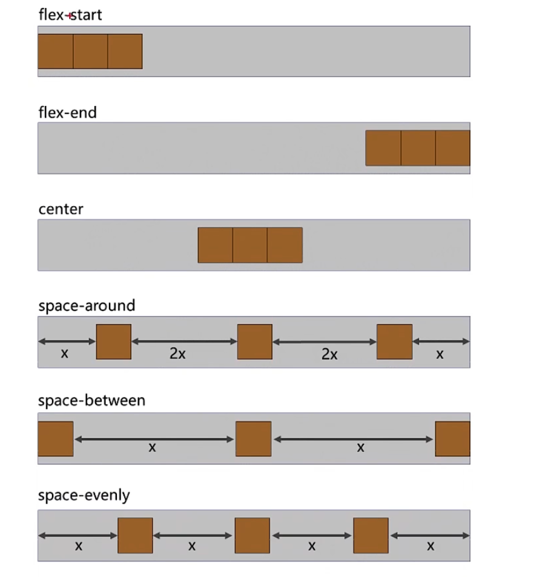

## frontend-study-css3
These are my notes with CSS3 studying

### 新增长度单位

### box-sizing

### 伸缩盒模型
> [!IMPORTANT]
> 神中神
1. 简介

2. 伸缩容器、伸缩项目

3. 主轴方向

4. 主轴换行方式

5. flex_flow
> 请别用这种方式，分开写成`flex-direction` + `flex-wrap`吧

6. 主轴对齐方式
 

